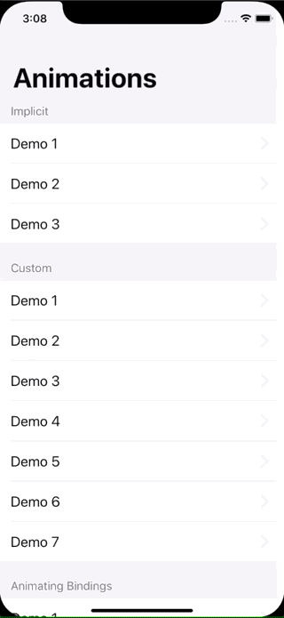

# Animations (SwiftUI)

## Description
In this technique project we’re going to look at a range of animations and transitions with SwiftUI. Some are easy – in fact, you’ll be able to get great results almost immediately! – but some require more thinking. All will be useful, though, particularly as you work to make sure your apps are attractive and help guide the users eyes as best as you can.

## Demo
| Demo |
| ---- |
|  |